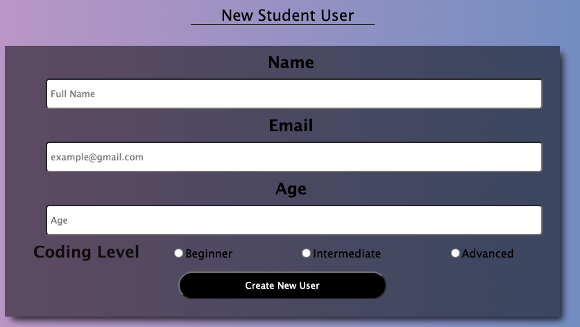

# CRUDOperationsApp

CRUD application with MERN Stack: MongoDB, Express, React and NodeJS

Key Features

1 . Make a New User
2 . Update Information of a User
3 . Delete a User
4 . Display a Table of a Database of Students

Steps for Set Up

1.  git clone https://github.com/nurgul-ths/CRUDOperationsApp.git

2.  Navigate to server folder in a separate terminal window
    cd server

3.  npm run devStart

4.  Navigate to client folder in a separate terminal window
    cd client

5.  npm run start
    [Photo](photo.png)
    
